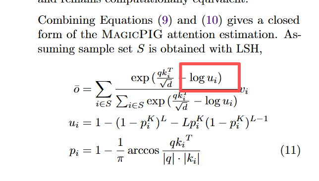

- [x] Adapt `sparsetoken_decode_flash_attention_redundant_var_len_paged.py` to support attention with norm in MagicPIG

new file: `magicpig_sparsetoken_decode_flash_attention_redundant_var_len_paged_with_norm.py`

> u的shape和attention mask的shape一样

> 就是q*k的shape

> 现在想要的就是实现这个公式里的attention计算. 我发现这里需要比普通attention多提供的参数好像就 K 和 L 啊

> u根据 q,k, K,L 算出就行了

> K和L对于不同的head是不一样的
